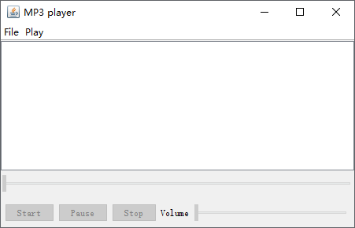
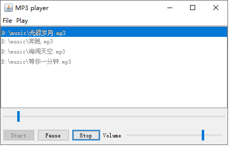

# 音乐播放器
# 1. 功能描述  
本程序使用JavaSound实现了一个简易的MP3播放器，功能包括：播放、暂停、停止，添加歌曲到播放列表，循环播放，可视化显示当前播放进度，音量调节等。另外需要说明的是，本播放器只支持播放MP3格式的音频。
# 2. 算法设计  
## (1)	初始化  
1)	初始化界面中的各个组件，包括菜单、按钮、进度条等。  
2)	建立播放列表数据结构，用来存放即将播放的MP3文件。  
3)	设置“开始”、“暂停”、“停止”状态（不可点击）。  
## (2)	播放过程中涉及的算法   
1)	播放。首先获取播放列表中的MP3文件，然后进行格式转换以获得音频格式，接着进行音频输入流转换，最后开始播放音乐。  
2)	播放进度实时显示。通过文件的大小（以字节为单位）以及音频格式的播放速度（以位/秒为单位）确定音频文件的总播放时间（以微秒为单位）。即播放时间为文件长度 * 800000/播放速度。然后利用播放时间来设置进度条的最大范围，并通过播放过程中的当前时间来确定进度条的位置。  
3)	循环播放。每次播放一个音频文件就让文件列表中的索引自动加1，如果当前索引的值大于文件列表的总长度，则将索引的值置0，即播放列表中的第一个文件，从而实现循环播放。  
4)	播放下一个文件。将当前的播放数据置空则播放器播放下一个文件。 
5)	播放上一个文件。将当前播放数据置空，并将当前播放索引减2。减2的原因是当前播放索引总是指向当前播放文件的下一个位置，因此需要减2。  
6)	播放状态转换。如果在播放过程中点击“停止”按钮，则当前播放线程终止，并且将进度条的位置置0；如果在播放过程中点击“暂停”按钮，则当前播放线程休眠，等待播放状态的下一次改变。  
# 3.	功能实现  
## (1)界面的设计  
本播放器实现的功能包括：播放、暂停、停止，添加歌曲到播放列表，循环播放，可视化显示当前播放进度，音量调节等。因此对应的界面包括：菜单用来打开音频文件、进行音频播放的切换，按钮用来进行播放状态的切换，列表用来显示当前载入的音频文件列表，进度条用来查看播放进度以及进行播放声音的调整，如下图。  
  
## (2)	播放的设计  
在用户添加音频文件后，播放器载入音频文件并进行音频格式转换，然后开始播放音频。在播放的过程中可以通过“播放”菜单中的“上一首”以及“下一首”进行播放切换，如下图。也可以通过“播放”、“暂停”、“停止”三个按钮改变播放状态。  
  
## (3) 请读者按照下面的要求将程序补充完整：  
1)	添加“暂停”按钮，点击该按钮，暂停播放。  
2)	实现“播放”菜单中的“上一曲”的功能，选择该菜单项，可以播放上一曲。  
3)	实现“播放”菜单中的“下一曲”的功能，选择该菜单项，可以播放下一曲。  
4)	添加调整播放进度的进度条。  
5)	添加调整音量的进度条。  
## 4.	思考与练习  
(1)	修改程序，在界面上添加“快进”按钮，实现“快进”，添加“后退”按钮，实现“后退”功能。  
(2)	修改程序，使“播放列表”处于可用状态，双击该列表中的某一首歌曲，开始播放该首歌曲。  
(3)	修改程序，使播放进度条可用，拖动滑块到某一个点时，使得音乐可以从当前位置开始播放。  
(4)	修改程序，使得该播放器支持多种音频格式。

# 教师参考答案
请教师用户首先访问[教师项目群组](https://www.codecode.net/engintime/Eclipse-Group/teachers-packet/java-lang),申请权限并审核通过后，再[domain relative url](engintime/Eclipse-Group/teachers-packet/java-lang/JLab068.git)访问本项目的参考答案